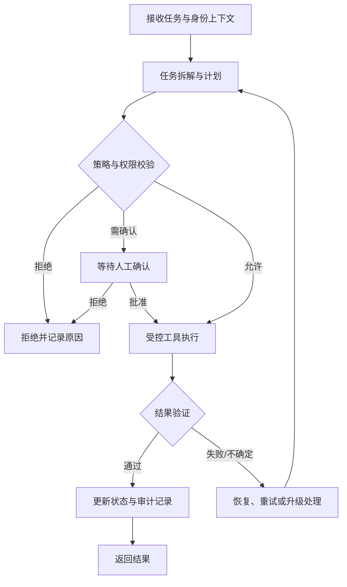

## 架构目标

架构将模型的规划能力与具有副作用的执行能力分离。模型提出计划或工具参数；策略层负责授权与风险判断；受控执行层调用工具；验证和审计组件检查并记录结果。模型输出本身不应被视为授权，也不应直接绕过策略层触达外部系统。

## 逻辑组件

1. **请求入口与身份上下文：** 接收任务，建立用户、租户、会话及关联标识。
2. **任务编排器：** 将任务表示为有依赖关系的步骤，维护运行状态和截止时间。
3. **规划器：** 根据目标和可用能力提出步骤或工具调用请求，不直接执行高风险操作。
4. **策略与权限网关：** 校验主体、资源、操作和上下文；拒绝越权请求，并对高风险操作触发人工确认。
5. **工具适配器：** 以受限凭据调用外部系统，规范化超时、错误和返回值。
6. **验证器：** 使用规则、结构化约束或领域校验器检查执行结果；无法强验证时明确标注置信边界。
7. **状态与审计存储：** 保存步骤状态、必要的检查点、策略决策和工具调用记录，避免记录不必要的敏感数据。

## 执行生命周期

## 状态与失败恢复

每个步骤至少应区分待执行、运行中、成功、失败、等待确认和已取消等状态。重试需要考虑幂等性与副作用：只对安全可重试的操作自动重试；对不确定是否已生效的写入操作先核验外部状态，避免重复提交。检查点应支持从最后一个安全边界恢复，而不是盲目重放整个任务。

## 安全与可观测性

凭据由工具适配层按需提供并限制作用域；日志应记录调用身份、策略结果、工具名称、时间与结果类别，同时对秘密和敏感内容进行过滤。跨租户访问、权限升级以及不可逆操作应有明确的拒绝或人工审批策略。

## 待验证事项

组件边界和流程目前是设计稿。后续需要以原型验证故障恢复正确性、权限绕过面、端到端延迟、审计完整性及人工确认对任务成功率的影响，并公开实验设置与局限。
